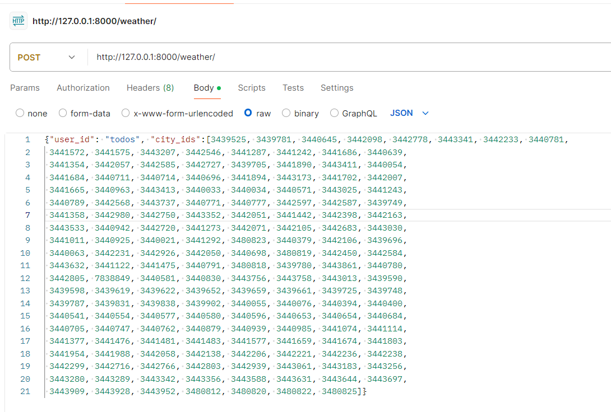
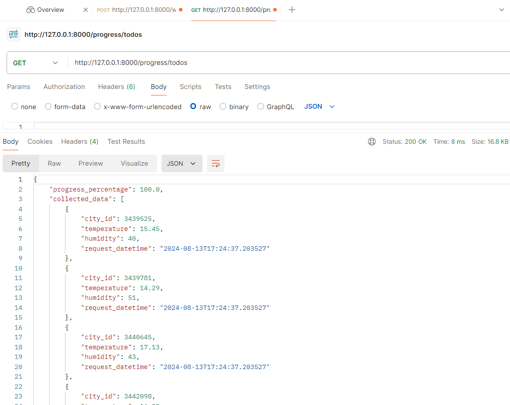

## Create a file:
.env
# include your api key as: API_KEY='you_API_KEY_Value'

## Build Docker Image
docker build -t weather_service .
## Run Docker Container:
docker run -d -p 8000:8000 weather_service

# Run locAL
uvicorn main:app --reload
# post format
http://127.0.0.1:8000/weather/
# body request
{"user_id": "uniqueNameforRequest", "city_ids":[ 3439525, 3439781, 3440645, 3442098]}
 ex:
 

## Testing
curl -X POST "http://127.0.0.1:8000/weather/" -H "Content-Type: application/json" -d "{\"user_id\":\"uniqueNameforRequest\", \"city_ids\":[3439525, 3439781]}"

## Check progress
curl "http://127.0.0.1:8000/progress/uniqueNameforRequest"
